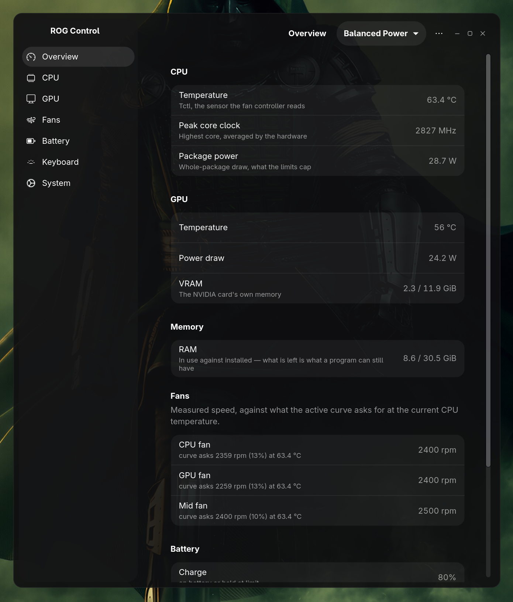

# ROG Control

A [G-Helper](https://github.com/seerge/g-helper)-style control panel for ASUS ROG laptops on Linux — without needing `asusctl`. One window, a tray icon, and background services that keep your settings in force across suspend, reboot, and firmware resets.

> **Tested only on an ASUS ROG Strix G16 (G614PR)** — Ryzen 9 8940HX, RTX 5070 Ti — on Arch/CachyOS with GNOME on Wayland. It may well work on other ROG models with the same embedded-controller family, but nothing beyond the G614PR has been verified. If you try it on different hardware, please open an issue with what worked and what didn't.



## Table of contents

- [Features](#features)
- [What you need](#what-you-need)
- [Installing](#installing)
- [Updating](#updating)
- [Uninstalling](#uninstalling)
- [Warnings](#warnings)
- [Credits](#credits)
- [License](#license)

## Features

Every feature below is followed by what it needs to work. If a dependency is missing, the app disables that control rather than failing silently — the installer's final summary and each control's tooltip say exactly why.

### Profiles
Four to start with — Quiet, Balanced Power, Balanced Performance, Performance — and you can add your own. A profile holds everything at once: CPU power limits, undervolt, turbo on/off, a maximum clock, an energy preference, GPU limits, and a fan curve for each of the three fans. Switching profile applies all of it and moves the OS power mode to match.

Export writes everything — every profile, the charge limit, keyboard settings, auto-switch targets, fan RPM calibration — to one JSON file, doubling as a full backup. Import can restore from that backup or merge in a single older profile export.

*Requires: nothing extra — always available.*

### Fans
An eight-point curve per fan, dragged on a graph showing real RPM. "Calibrate fan RPM" measures how your own fans respond so the graph is accurate for your machine, not the developer's.

*Requires: nothing extra — reads/writes the embedded controller directly.*

### CPU
STAPM, fast and slow power limits, temperature target, Curve Optimizer undervolt, turbo boost, and a maximum core clock.

*Requires: `ryzenadj` (AMD only) — and on some kernels, the `ryzen_smu` module.*

### GPU
Power limit, core/memory clock offsets, a clock ceiling, NVIDIA Dynamic Boost, and temperature target. Live temperature and fan speed for both CPU and GPU are also shown.

*Requires: `nvidia-utils` (temperature/power limit) and `nvidia-settings` (clock offsets) — NVIDIA only.*

Graphics mode switching between Integrated, Hybrid, and AsusMuxDgpu.

*Requires: `supergfxctl`.*

### Keyboard
Brightness and ten lighting modes: Static, Breathing, Pulse, Colour Cycle, Rainbow, Gradient Static, GPU Temp Colour, CPU Temp Colour, Battery Level, and Ambient (follows what's on screen, via the desktop's screen-sharing portal).

*Requires: `rogauracore`. Modes your hardware can't perform are not offered.*

### Battery
A charge limit, and automatic profile switching on plug/unplug — runs in the background so it works whether or not the window is open.

*Requires: nothing extra — always available.*

### System
Shows whether `asusd` (asusctl's daemon) is installed and running, since it drives the same hardware and the two will fight over fans and lighting if both run. Buttons to stop/disable it and put it back — no uninstall button, since removing a package is shown to you as the exact command to run yourself.

A switch for the boot chime, remembered so a boot-apply service can restore it after a BIOS update resets the firmware.

*Requires: nothing extra — always available. The asusd conflict check needs asusctl to be present to say anything.*

### Also
- Live RAM and VRAM use on the overview page
- A tray icon that shows and switches the active profile (needs `libayatana-appindicator`)
- Keyboard shortcuts for cycling profiles and lighting modes (bind them yourself — see [1-HOW-TO-INSTALL.txt](rogcontrol/1-HOW-TO-INSTALL.txt))
- Desktop notifications for background events (needs `libnotify`)
- Everything you configure lives in one file: `~/.config/rogcontrol.json`

## What you need

**Required**, checked by the installer before it touches anything:

```
Arch/CachyOS   sudo pacman -S gtk4 libadwaita python-gobject
Fedora         sudo dnf install gtk4 libadwaita python3-gobject
Debian/Ubuntu  sudo apt install libgtk-4-1 libadwaita-1-0 python3-gi
```

**Optional**, each only costing the feature that needs it — the installer detects what's missing and offers to install it:

| Package | Enables |
|---|---|
| `ryzenadj` | CPU power limits and undervolt (AMD only) |
| `nvidia-utils` | GPU temperature and power limit |
| `nvidia-settings` | GPU clock offsets |
| `supergfxctl` | Switching between integrated and hybrid graphics |
| `rogauracore` | Keyboard colours and lighting modes |
| `libayatana-appindicator` | The tray icon |
| `libnotify` | Desktop notifications |

## Installing

```
git clone https://github.com/fadi9711/rogcontrol.git
cd rogcontrol/rogcontrol
./install.sh
```

Do **not** run it as root. It asks for your password twice, and only for the two things that genuinely need it:

- installing the privileged helper to `/usr/local/bin/rogcontrol-helper`
- adding a sudoers rule so the app can call that one helper without a password prompt every time you move a slider

The rule grants exactly one binary to your user, and is validated with `visudo` before being put in place.

The installer will:

- check GTK4 and libadwaita, and stop if they're absent
- confirm the machine is an ASUS
- install missing optional dependencies, with your permission
- build `ryzenadj` and `rogauracore` from source if your distro has no package for them — Arch/CachyOS only, via an AUR helper; on Fedora and Debian/Ubuntu it only warns, since it carries no source build for those toolchains
- install the app to `~/.local/lib/rogcontrol` and a launcher on your PATH
- install the tray, the background services, the icon and the menu entry
- on a fresh install, write defaults and apply them; on an update, keep every setting and back the file up first
- end by listing which features work on your machine and which don't, and why

After installing:

```
rogcontrol          # open the window
rogcontrol-tray      # the tray icon (starts itself at every login)
```

The window is also in your applications menu as "ROG Control". Open the Fans page once and press **Calibrate fan RPM** — it takes about two minutes and makes the graphs true for your own hardware.

Full details, including binding the keyboard shortcuts, are in [1-HOW-TO-INSTALL.txt](rogcontrol/1-HOW-TO-INSTALL.txt).

## Updating

Run `./install.sh` from the newer version. It detects the existing install and keeps your profiles, fan curves, calibration and keyboard settings — your settings file is backed up with a date stamp first.

## Uninstalling

```
~/.local/bin/rogcontrol-uninstall.sh
```

Removes the app, the helper, the sudoers rule and the background services. Leaves your settings file (`~/.config/rogcontrol.json`) alone unless you ask it to go too.

## Warnings

- **The Curve Optimizer undervolt can freeze your machine.** Too negative locks the system solid under load — this happened on the development laptop at −20. Move two or three counts at a time and test before going further.
- **Import replaces everything.** Importing a full backup is a restore, not a merge — it asks to confirm, and there is no undo. A single-profile export is safe to import at any time; it merges in without touching anything else.
- **Removing asusd is your call, not the app's.** The System page shows the exact removal command for your distro rather than running it, because uninstalling a package is a transaction you should see and confirm yourself.
- **This has been verified on one laptop.** The ROG Strix G16 (G614PR) is the only machine this has been tested against. Other ASUS ROG models use different embedded-controller firmware; behaviour — especially the fan curve and CPU/GPU limit ranges — is not guaranteed elsewhere.

## Credits

This app talks to hardware through tools built and maintained by other people. None of them are bundled here — the installer detects and installs them, or builds them from source, but the projects and their licenses are their own:

- **[asusctl](https://gitlab.com/asus-linux/asusctl)** (asus-linux) — the reference for how this hardware talks to Linux, and the daemon this app coexists with (or replaces) on your system.
- **[ryzenadj](https://github.com/FlyGoat/RyzenAdj)** (FlyGoat) — CPU power limit and undervolt access on AMD Ryzen.
- **[rogauracore](https://github.com/aaaaaomg/rogauracore)** — keyboard RGB colour and lighting modes.
- **[supergfxctl](https://gitlab.com/asus-linux/supergfxctl)** (asus-linux) — graphics mode switching.
- **[GTK4](https://gtk.org/) and [libadwaita](https://gnome.pages.gitlab.gnome.org/libadwaita/)** (GNOME) — the toolkit this app's interface is built on.
- **[libayatana-appindicator](https://github.com/AyatanaIndicators/libayatana-appindicator)** — the tray icon.

Special thanks to the **[G-Helper](https://github.com/seerge/g-helper)** developer — G-Helper is what a Windows-side ASUS control panel should look like, and it's the direct inspiration for what this app tries to be on Linux.

## License

[GPL-3.0](LICENSE). See the [LICENSE](LICENSE) file for the full text.
