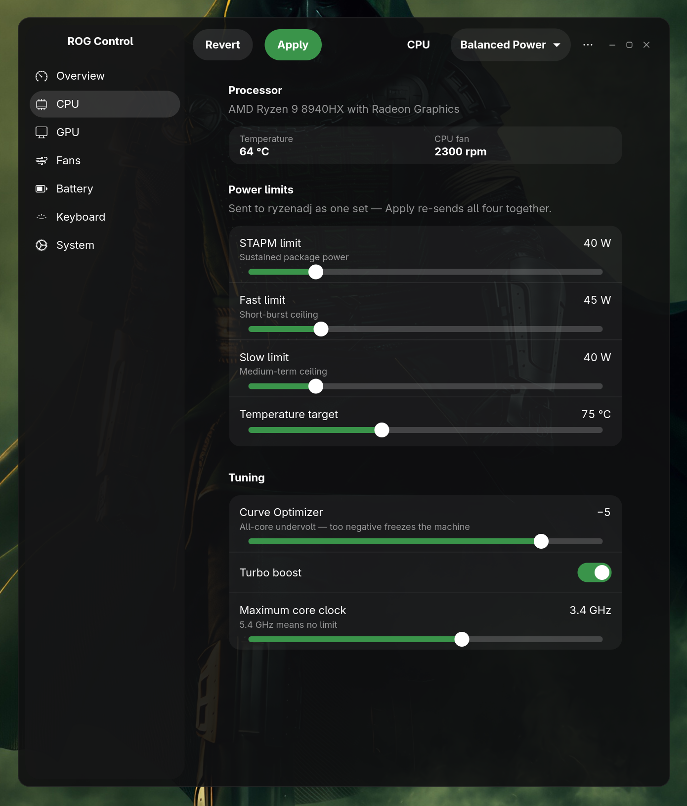
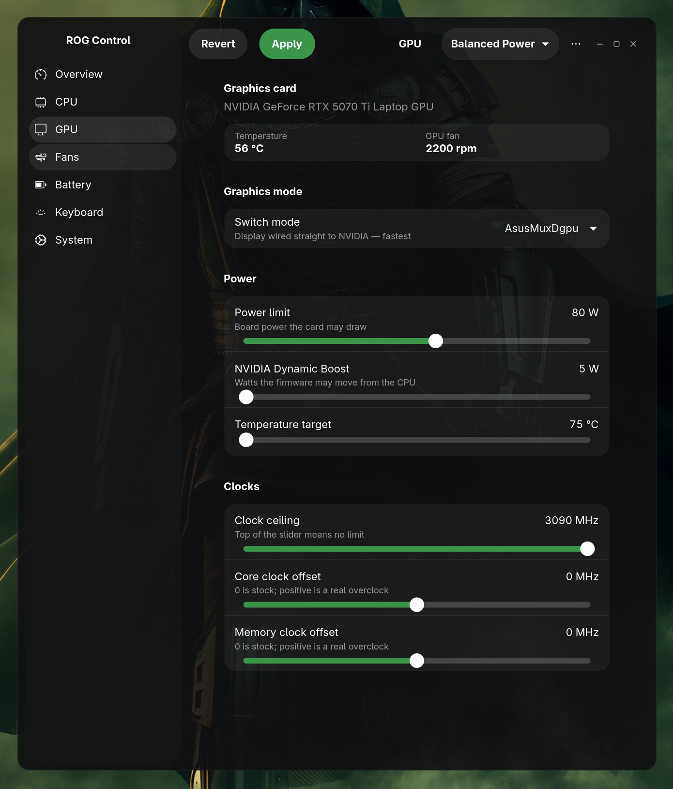
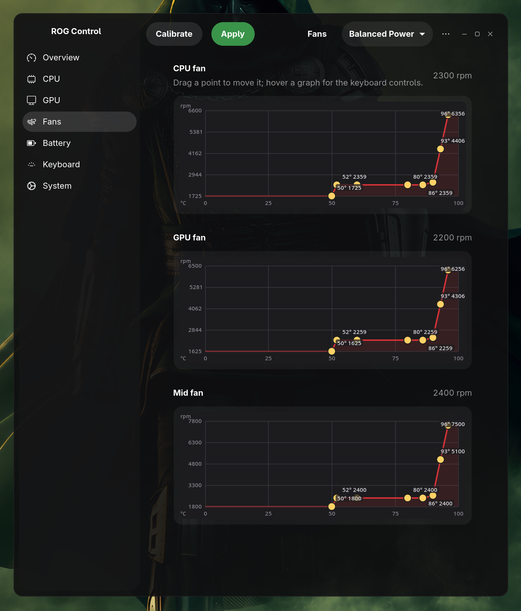
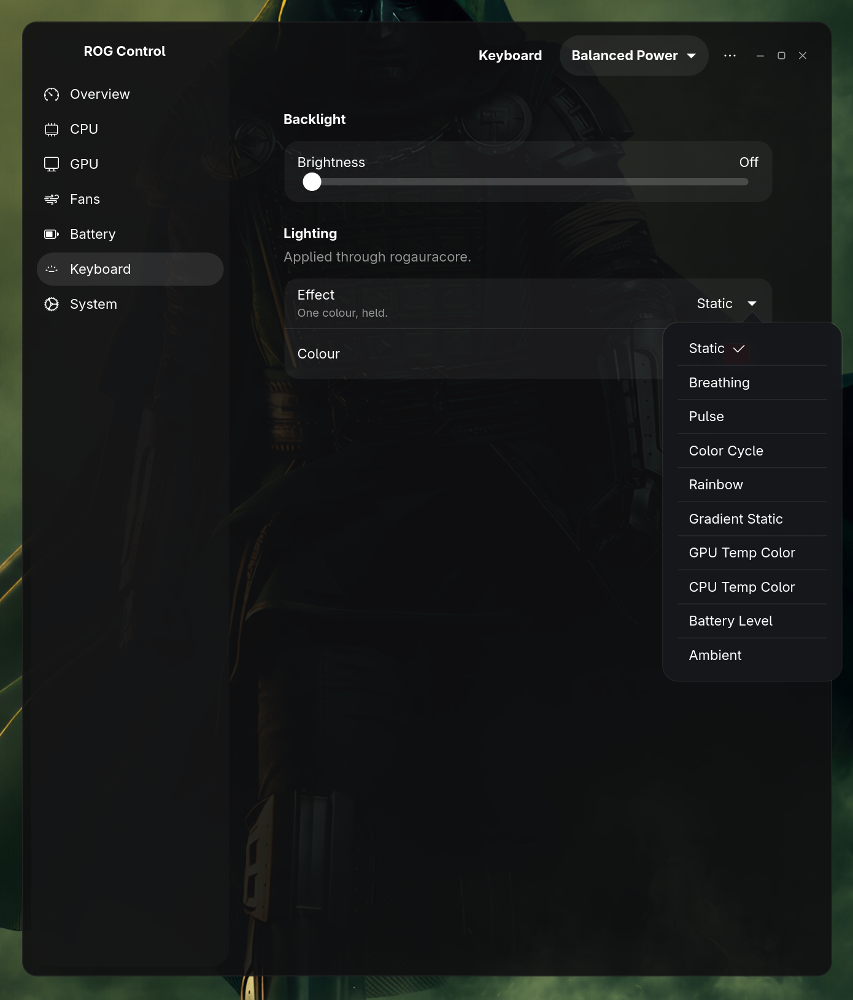

# ROG Control

A control panel for ASUS ROG laptops on Linux — without needing `asusctl`. One window, a tray icon, and background services that keep your settings in force across suspend, reboot, and firmware resets.

> **Tested only on an ASUS ROG Strix G16 (G614PR)** — Ryzen 9 8940HX, RTX 5070 Ti — on Arch/CachyOS with GNOME on Wayland. It may well work on other ROG models with the same embedded-controller family, but nothing beyond the G614PR has been verified. If you try it on different hardware, please open an issue with what worked and what didn't.
>
> **NVIDIA GPU only.** GPU controls go through `nvidia-smi`/`nvidia-settings`, so Intel and AMD GPUs are not supported. CPU support depends on the vendor: on AMD, power limits and the Curve Optimizer go through `ryzenadj`; on Intel, PL1/PL2, turbo boost, the energy preference and the clock ceiling and floor work where the model's firmware exposes them (no undervolt, no temperature target — neither has an Intel equivalent). A CPU with none of those firmware nodes gets a notice on the CPU page instead of a control that would only fail.


| | |
|---|---|
|  |  |
|  |  |

## Table of contents

- [Features](#features)
- [What you need](#what-you-need)
- [Installing](#installing)
- [Keyboard shortcuts](#keyboard-shortcuts)
- [Sample config](#sample-config)
- [Updating](#updating)
- [Uninstalling](#uninstalling)
- [Warnings](#warnings)
- [Credits](#credits)
- [License](#license)

## 🚀 Features

Every feature below is followed by what it needs to work. If a dependency is missing, the app disables that control rather than failing silently — the installer's final summary and each control's tooltip say exactly why.

### 🗂️ Profiles
Four to start with — Quiet, Balanced Power, Balanced Performance, Performance — and you can add your own. A profile holds everything at once: CPU power limits, undervolt, turbo on/off, a maximum clock, an energy preference, GPU limits, and a fan curve for each of the three fans. Switching profile applies all of it and moves the OS power mode to match.

Export writes everything — every profile, the charge limit, keyboard settings, auto-switch targets, fan RPM calibration — to one JSON file, doubling as a full backup. Import can restore from that backup or merge in a single older profile export.

*Requires: nothing extra — always available.*

### 🌀 Fans
An eight-point curve per fan, dragged on a graph showing real RPM. "Calibrate fan RPM" measures how your own fans respond so the graph is accurate for your machine, not the developer's.

*Requires: nothing extra — reads/writes the embedded controller directly.*

### ⚡ CPU
STAPM, fast and slow power limits, temperature target, Curve Optimizer undervolt, turbo boost, and a maximum core clock.

*Requires: `ryzenadj` (AMD only) — and on some kernels, the `ryzen_smu` module.*

### 🎮 GPU
Power limit, core/memory clock offsets, a clock ceiling, NVIDIA Dynamic Boost, and temperature target. Live temperature and fan speed for both CPU and GPU are also shown.

*Requires: `nvidia-utils` (temperature/power limit) and `nvidia-settings` (clock offsets) — NVIDIA only.*

Graphics mode switching between Integrated, Hybrid, and AsusMuxDgpu.

*Requires: `supergfxctl`.*

### ⌨️ Keyboard
Brightness and ten lighting modes: Static, Breathing, Pulse, Colour Cycle, Rainbow, Gradient Static, GPU Temp Colour, CPU Temp Colour, Battery Level, and Ambient (follows what's on screen, via the desktop's screen-sharing portal).

*Requires: `rogauracore`. Modes your hardware can't perform are not offered.*

### 🔋 Battery
A charge limit, and automatic profile switching on plug/unplug — runs in the background so it works whether or not the window is open.

*Requires: nothing extra — always available.*

### ⚙️ System
Shows whether `asusd` (asusctl's daemon) is installed and running, since it drives the same hardware and the two will fight over fans and lighting if both run. Buttons to stop/disable it and put it back — no uninstall button, since removing a package is shown to you as the exact command to run yourself.

A switch for the boot chime, remembered so a boot-apply service can restore it after a BIOS update resets the firmware.

*Requires: nothing extra — always available. The asusd conflict check needs asusctl to be present to say anything.*

### ✨ Also
- Live RAM and VRAM use on the overview page
- A tray icon that shows and switches the active profile (needs `libayatana-appindicator`)
- Keyboard shortcuts for cycling profiles and lighting modes (bind them yourself — see [1-HOW-TO-INSTALL.txt](rogcontrol/1-HOW-TO-INSTALL.txt))
- Desktop notifications for background events (needs `libnotify`)
- Everything you configure lives in one file: `~/.config/rogcontrol.json`

## 📋 What you need

**Required**, checked by the installer before it touches anything:

```
Arch/CachyOS          sudo pacman -S gtk4 libadwaita python-gobject
Fedora (traditional)  sudo dnf install gtk4 libadwaita python3-gobject
Debian/Ubuntu         sudo apt install libgtk-4-1 libadwaita-1-0 python3-gi
```

**On Bazzite or any other atomic/ostree Fedora system, don't run that Fedora line by hand** — there is no `dnf` there and it will fail with "command not found". Just run `./install.sh`; it detects the atomic system and layers these with `rpm-ostree` itself (see the Bazzite section below).

**Optional**, each only costing the feature that needs it — the installer detects what's missing and offers to install it:

| Package | Enables |
|---|---|
| `ryzenadj` | CPU power limits and undervolt (AMD only) |
| `nvidia-utils` | GPU temperature and power limit |
| `nvidia-settings` | GPU clock offsets |
| `supergfxctl` | Switching between integrated and hybrid graphics |
| `rogauracore` | Keyboard colours and lighting modes |
| `libayatana-appindicator` | The tray icon |
| `libnotify` | Desktop notifications |

## 📦 Installing

```
cd ~
git clone https://github.com/D0minatorX/rogcontrol.git
cd rogcontrol/rogcontrol
./install.sh
```

The `cd ~` first matters: `git clone` puts the `rogcontrol` folder wherever your terminal currently is, and on some setups that's `~/Downloads` (a file manager's "Open Terminal Here", or a terminal that starts there by default) rather than your home folder — then `cd rogcontrol/rogcontrol` still works, it just leaves the clone sitting in Downloads instead of somewhere sensible.

If you used GitHub's green **Code → Download ZIP** button instead of `git clone`, the extracted folder is named `rogcontrol-main` (or `rogcontrol-gtk4-ui`), not `rogcontrol` — `cd rogcontrol/rogcontrol` will fail with "No such file or directory" in that case. Either extract and `cd` into that folder's own `rogcontrol` subfolder instead (e.g. `cd rogcontrol-main/rogcontrol`), or just use `git clone` as above.

One command on every supported distro. The installer reads `/etc/os-release`, so derivatives are handled by family rather than by name — CachyOS is treated as Arch, Bazzite as Fedora — and it detects your desktop (GNOME or KDE Plasma) to tell you whether the tray needs anything extra.

### On Bazzite and other atomic systems

Fedora Atomic images (Bazzite, Silverblue, Kinoite — GNOME and KDE Plasma spins alike) have a read-only `/usr` and no `dnf`, so packages can't simply be installed the normal way. The installer handles all of this itself, automatically:

- **GTK4/libadwaita** (required) are layered onto the system with `rpm-ostree`, then it tells you to reboot and run `./install.sh` once more — the second run finishes automatically and asks nothing.
- **supergfxctl** (optional, GPU mode switching) isn't in Fedora's own repos at all — the installer adds the `lukenukem/asus-linux` COPR itself before layering it, so you don't have to find or add that repo by hand.
- **power-profiles-daemon** (optional, OS power-mode sync) is skipped automatically if Bazzite's `tuned-ppd` is already on the system — the two packages conflict (both provide the same service), and the app already talks to `tuned-ppd` just as well, so there's nothing to install or resolve yourself.

Everything else — the privileged helper, the sudoers rule, the background services, the suspend hook and your settings — installs onto the real system exactly as it does everywhere else. The one cost is the reboot(s) for whatever got layered, and layered packages can make future OS updates slower and occasionally break them.

### On CachyOS and other Arch systems

Nothing special: `./install.sh` follows the normal pacman path, and builds `ryzenadj` (AMD CPUs only) and `rogauracore` from the AUR. CachyOS's default Plasma desktop shows tray icons natively, so there's no extra step for the tray there.

### The tray icon on GNOME

GNOME Shell has no built-in support for tray icons and needs the **AppIndicator and KStatusNotifierItem Support** extension on top of the `libayatana-appindicator` library — without it the tray runs but shows nothing. The installer checks for it and tells you if it's missing. KDE Plasma needs nothing extra.

Do **not** run it as root. It asks for your password twice, and only for the two things that genuinely need it:

- installing the privileged helper to `/usr/local/bin/rogcontrol-helper`
- adding a sudoers rule so the app can call that one helper without a password prompt every time you move a slider

The rule grants exactly one binary to your user, and is validated with `visudo` before being put in place.

The installer will:

- check GTK4 and libadwaita, and stop if they're absent
- confirm the machine is an ASUS
- install missing optional dependencies, with your permission
- build `ryzenadj` (AMD CPUs only) and `rogauracore` from source if your distro has no package for them — Arch/CachyOS only, via an AUR helper; on Fedora and Debian/Ubuntu it only warns, since it carries no source build for those toolchains
- install the app to `~/.local/lib/rogcontrol` and a launcher on your PATH
- install the tray, the background services, the icon and the menu entry
- on a fresh install, write defaults and apply them; on an update, keep every setting and back the file up first
- on a non-AMD CPU, write a hardware report to your Downloads folder and print the path
- end by listing which features work on your machine and which don't, and why

After installing:

```
rogcontrol          # open the window
rogcontrol-tray      # the tray icon (starts itself at every login)
```

The window is also in your applications menu as "ROG Control". Open the Fans page once and press **Calibrate fan RPM** — it takes about two minutes and makes the graphs true for your own hardware.

Full details, including binding the keyboard shortcuts, are in [1-HOW-TO-INSTALL.txt](rogcontrol/1-HOW-TO-INSTALL.txt).

## ⌨️ Keyboard shortcuts

The installer does not bind these for you — a hotkey is a personal choice, and every desktop binds them differently. These scripts are installed to `~/.local/bin`, ready to bind to any key you like:

| Command | Does |
|---|---|
| `rogcontrol-cycle-profile.py` | Next profile |
| `rogcontrol-cycle-kbdlight.py` | Next keyboard lighting mode |
| `rogcontrol-adjust-kbdbrightness.py up\|down` | Keyboard backlight brightness |
| `rogcontrol-adjust-kbdspeed.py up\|down` | Current lighting effect's speed |
| `rogcontrol --show` | Bring the window up |
| `rogcontrol --hide` | Put it away without quitting |
| `rogcontrol --toggle` | Show/hide depending on current state |

The brightness and speed scripts take one argument, so each needs its own binding for `up` and one for `down` — four bindings, not two. The speed one only does anything on Breathing, Pulse, Color Cycle or Rainbow; on any other mode it's a no-op, since those are a fixed picture with no animation to speed up.

`--show`/`--hide` are two ends of one thing, not a toggle: `--show` always brings the window up, `--hide` always puts it away without quitting — the window stays alive, invisible, so the next `--show` is instant. `--toggle` is what the tray's own "Show window" item uses if you'd rather have one key do either.

**On GNOME:** Settings → Keyboard → View and Customize Shortcuts → Custom Shortcuts → **+**. Point the command at the full path, e.g. `/home/YOUR_USERNAME/.local/bin/rogcontrol-cycle-profile.py` (GNOME needs the full path, not `~`). For `--show`/`--hide`/`--toggle`, the command is just `rogcontrol --show` — it's already on your PATH.

**On KDE Plasma:** System Settings → Keyboard → Shortcuts → **Add Command**. Same commands, same need for a full path rather than `~`. Plasma calls the entry a "Command/URL" shortcut; the trigger key is set on the same page once the command is in.

Every one of these notifies when it fails, and says what went wrong — a missing helper, a controller that did not answer, a mode with nothing to read a colour from. The same failure is also written to `~/.local/share/rogcontrol/rogcontrol.log`, which is where to look if the notification has already gone.

These bindings live in your desktop's own settings (GNOME stores them under dconf), not in the app — uninstalling or wiping `~/.config/rogcontrol.json` doesn't remove them, and a fresh install doesn't restore them either. Re-add them once after any clean install.

## 🧪 Sample config

[rogcontrol.sample.json](rogcontrol.sample.json) is the developer's own working config from a G614PR — five profiles (Quiet, Balanced Power, Balanced Performance, Performance, and a stress-test "Test" profile) with tuned CPU/GPU limits and fan curves.

To try it: open the header menu → **Import**, and pick this file. It has no profiles named the same as the stock ones colliding, they come in as "Name (2)" — your existing profiles, keyboard settings, charge limit and fan calibration are untouched, since Import only merges in the profiles a plain file like this contains. **Still run Calibrate fan RPM on the Fans page** before trusting any of these curves — the RPM numbers on the graph are for the developer's fans, not yours; the shape carries over, the numbers don't. The "Test" profile pushes power limits well past what most chips sustain; treat it as a curiosity, not something to select and forget.

## 🔄 Updating

Run `./install.sh` from the newer version. It detects the existing install and keeps your profiles, fan curves, calibration and keyboard settings — your settings file is backed up with a date stamp first.

## 🗑️ Uninstalling

```
~/.local/bin/rogcontrol-uninstall.sh
```

Removes the app, the helper, the sudoers rule and the background services. Leaves your settings file (`~/.config/rogcontrol.json`) alone unless you ask it to go too.

## ⚠️ Warnings

- **The Curve Optimizer undervolt can freeze your machine.** Too negative locks the system solid under load — this happened on the development laptop at −20. Move two or three counts at a time and test before going further.
- **Import replaces everything.** Importing a full backup is a restore, not a merge — it asks to confirm, and there is no undo. A single-profile export is safe to import at any time; it merges in without touching anything else.
- **Removing asusd is your call, not the app's.** The System page shows the exact removal command for your distro rather than running it, because uninstalling a package is a transaction you should see and confirm yourself.
- **This has been verified on one laptop.** The ROG Strix G16 (G614PR) is the only machine this has been tested against. Other ASUS ROG models use different embedded-controller firmware; behaviour — especially the fan curve and CPU/GPU limit ranges — is not guaranteed elsewhere.

## ❤️ Credits

This app talks to hardware through tools built and maintained by other people. None of them are bundled here — the installer detects and installs them, or builds them from source, but the projects and their licenses are their own:

- **[asusctl](https://gitlab.com/asus-linux/asusctl)** (asus-linux) — the reference for how this hardware talks to Linux, and the daemon this app coexists with (or replaces) on your system.
- **[ryzenadj](https://github.com/FlyGoat/RyzenAdj)** (FlyGoat) — CPU power limit and undervolt access on AMD Ryzen.
- **[rogauracore](https://github.com/aaaaaomg/rogauracore)** — keyboard RGB colour and lighting modes.
- **[supergfxctl](https://gitlab.com/asus-linux/supergfxctl)** (asus-linux) — graphics mode switching.
- **[GTK4](https://gtk.org/) and [libadwaita](https://gnome.pages.gitlab.gnome.org/libadwaita/)** (GNOME) — the toolkit this app's interface is built on.
- **[libayatana-appindicator](https://github.com/AyatanaIndicators/libayatana-appindicator)** — the tray icon.

Special thanks to the **[G-Helper](https://github.com/seerge/g-helper)** developer — G-Helper is what a Windows-side ASUS control panel should look like, and it's the direct inspiration for what this app tries to be on Linux. The bug report template also borrows its structure from G-Helper's own — thanks for that too.

## 📄 License

[GPL-3.0](LICENSE). See the [LICENSE](LICENSE) file for the full text.
